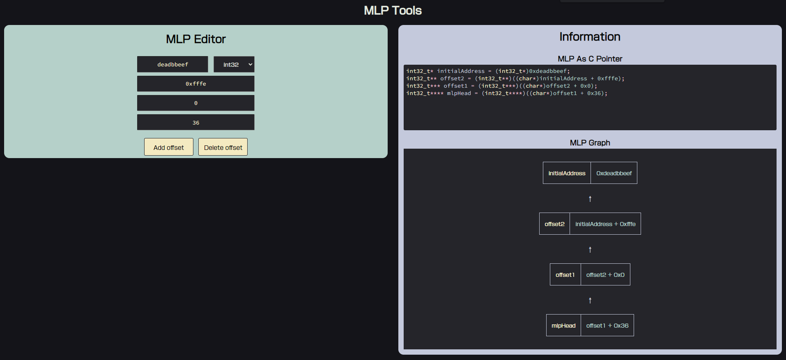

# MLPTools

MLPTools is a wbe app used for easily managing, modifying, and visualizing multi level pointers. It is made in Typescript with React.js as well as vanilla, custom HTML and CSS. It features a simple offset modification interface as well as accurate, responsive representations of the multi level pointer in C as well as a tree-like visualization.

# How to use

In the panel labeled "MLP Editor", you can input an initial address. This is the address of the variable you are attempting to track. Then, you will select the data type of said variable you are tracking. Then, you can add as many offsets as needed by clicking "Add Offset" and setting the appropriate values in hexadecimal.

In the panel labeled "Information", you can see the C code equivalent of the MLP you just created as well as a simple visualization of the MLP below that. It supports syntax highlighting so that you can easily distinguish and digest the visual information.

This site can be accessed by visiting [https://declspecl.github.io/MLPTools](https://declspecl.github.io/MLPTools).

# Screenshot / Example

